# Module: Auth & Onboarding

**ViewTypes**: `ONBOARDING`, `LOGIN`, `REGISTER`
**API Routes**: `/api/auth`, `/api/onboarding-v2`

## 1. User Journey (Flowchart)

## 2. Technical Flow (Sequence Diagram)

## 3. State Machine (UI)

```mermaid
stateDiagram-v2
    [*] --> RoleSelection
    
    state RoleSelection {
        [*] --> Idle
        Idle --> DentistSelected: Click 'Dentista'
        Idle --> OwnerSelected: Click 'Dono de Clínica'
        Idle --> PatientSelected: Click 'Paciente'
    }
    
    DentistSelected --> DataInput: Next
    OwnerSelected --> DataInput: Next (Includes Clinic Name)
    PatientSelected --> DataInput: Next
    
    state DataInput {
        [*] --> FormIdle
        FormIdle --> Validating: Typing
        Validating --> FormIdle
        FormIdle --> Submitting: Submit
    }
    
    Submitting --> Success: API 200
    Submitting --> Error: API 4xx/5xx
    
    Error --> FormIdle: Retry
    Success --> [*]: Redirect
```

## Gaps & Risks

- **Critical**: `quick-setup` endpoint must validate that the user doesn't already have an organization if trying to create one to prevent duplicates (though typical flow prevents this).
- **Critical**: Ensure `CPF` uniqueness constraint in DB is handled gracefully in UI.
- **Improvement**: Add progress steps indicator in UI for better UX.
