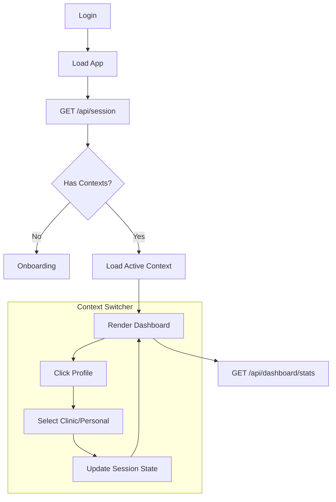
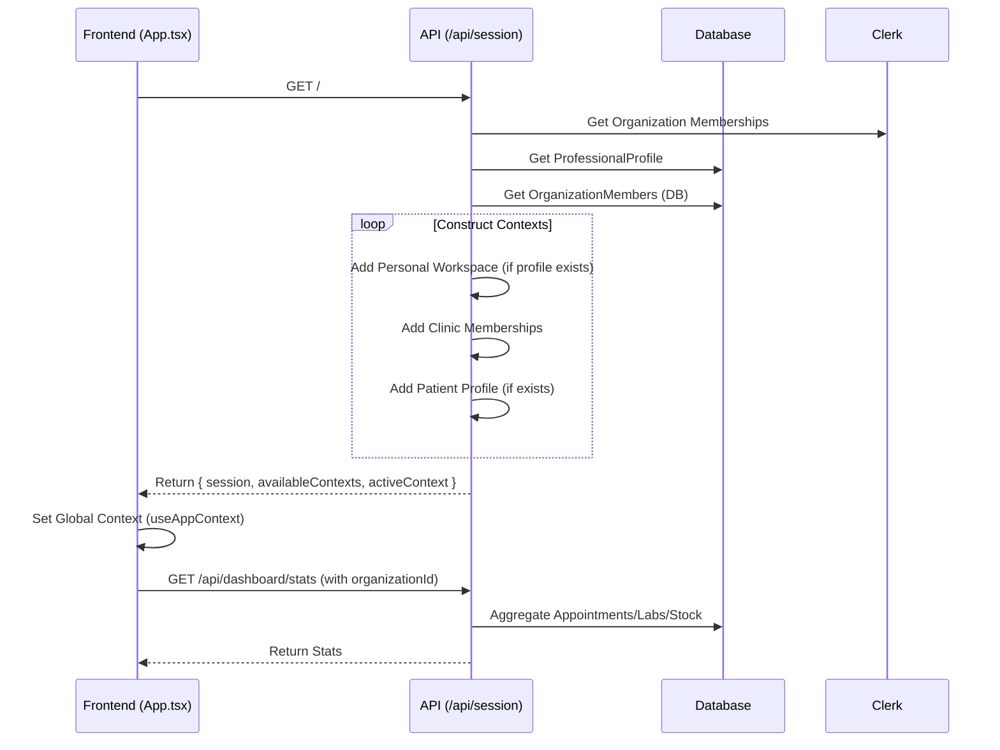
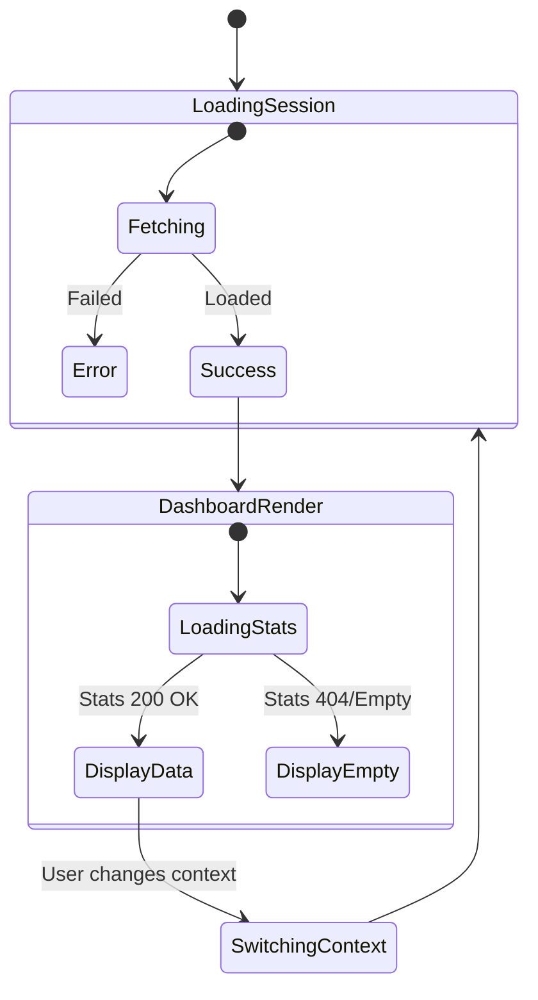

# Module: Dashboard & Context

**ViewTypes**: `DASHBOARD`
**API Routes**: `/api/session`, `/api/dashboard/stats`, `/api/dashboard/operations`

## 1. User Journey (Flowchart)

## 2. Technical Flow (Sequence Diagram)

## 3. State Machine (Dashboard)

## Data Access Rules (RBAC)

*   **Personal Context**: `organizationId` is a prefixed string (e.g., `personal-user_123`).
*   **Clinic Context**: `organizationId` is the UUID of the organization.
*   **Endpoints**:
    *   `/api/dashboard/stats`: Requires `organizationId` header or query param.
    *   `/api/dashboard/operations`: Fetches overdue labs and low stock.

## Gaps & Risks

*   **Performance**: `GET /api/session` performs multiple heavy DB calls + Clerk API call. Could be slow.
*   **Consistency**: `organizationId` for personal context is generated on the fly in `session.ts`. Ensure it is consistent across all other endpoints.
