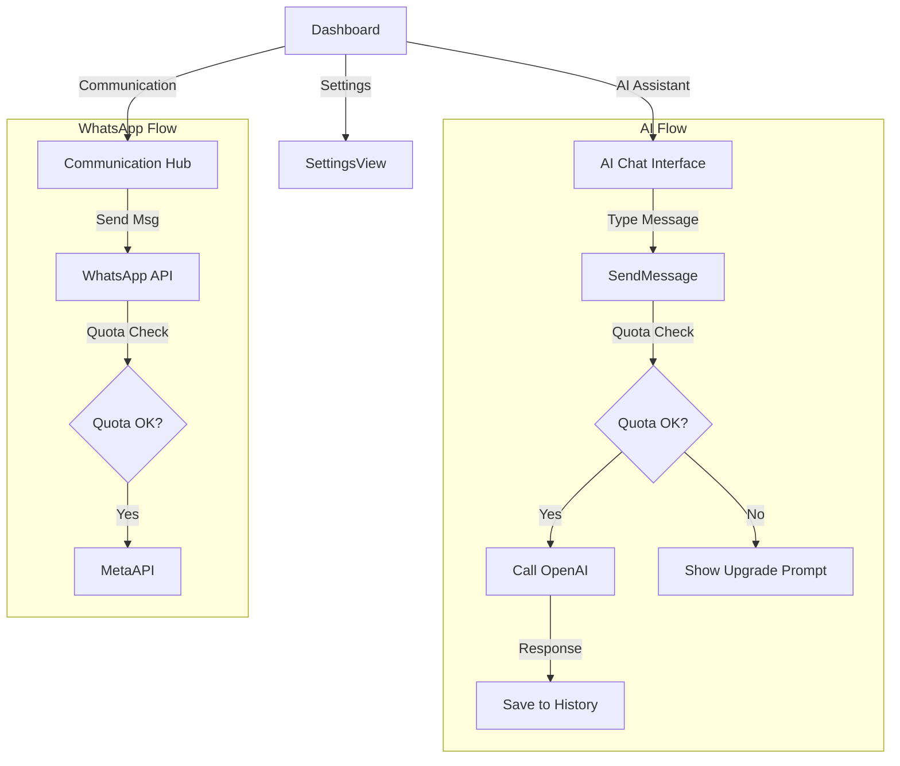

# Module: Communication, AI & Settings

**ViewTypes**: `COMMUNICATION`, `AI_ASSISTANT`, `SETTINGS`
**API Routes**: `/api/whatsapp`, `/api/ai`, `/api/settings`

## 1. User Journey (Flowchart)

## 2. Technical Capabilities

### AI Assistant (`/api/ai`)
*   **Role**: Assisted clinical decision support and management helper.
*   **Security**: `detectJailbreak`, `sanitizeInput`.
*   **Persistence**: Stores conversations in `aiConversations` and `aiMessages`.
*   **Policy**: Role-based tool access (Dentists get clinical tools, Receptionists get scheduling tools).

### WhatsApp (`/api/whatsapp`)
*   **Webhook**: Verifies generic tokens (`hub.verify_token`).
*   **Quota**: Hard limits on messages per organization tier.
*   **Templates**: Native Meta template support for notifications.

### Settings (`/api/settings`)
*   **Preferences**: User-level notification settings (Email, Push, WhatsApp).
*   **Testing**: `/test-email` endpoint for SMTP verification.

## Gaps & Risks

*   **AI Cost**: No hard cap on token usage per specific user, only organization-level quota (in theory). Jailbreak detection is basic.
*   **WhatsApp Webhook**: Implementation is basic (`console.log`). Needs a proper event bus to route incoming messages to the right context (e.g., confirm appointment).
