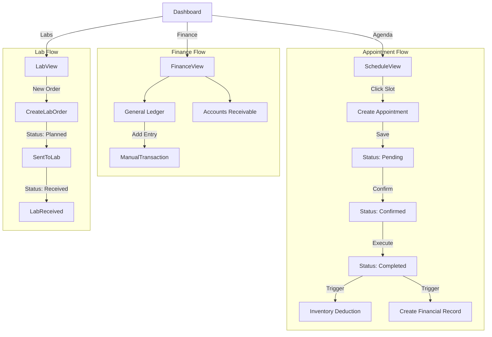
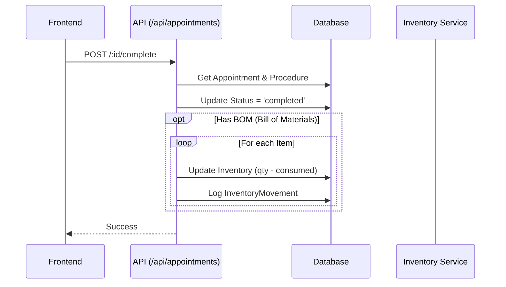
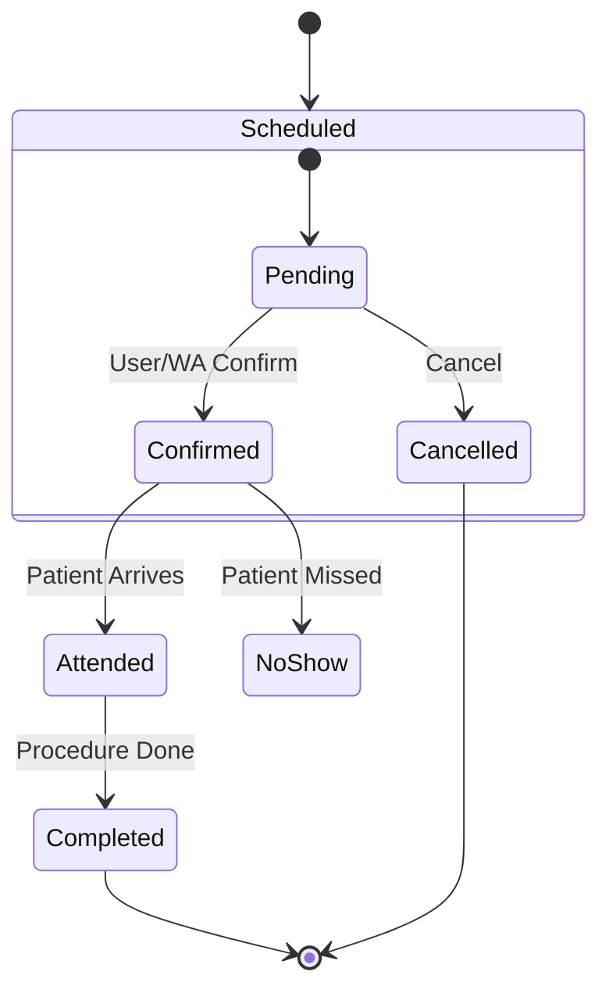

# Module: Operations & Finance

**ViewTypes**: `SCHEDULE`, `FINANCE`, `LABS`, `INVENTORY`
**API Routes**: `/api/appointments`, `/api/finance`, `/api/lab`, `/api/inventory`

## 1. User Journey (Flowchart)

## 2. Technical Flow (Sequence Diagram)

**Appointment Completion & Impacts**

## 3. State Machine (Appointment)

## Gaps & Risks

*   **Concurrency**: Inventory deduction doesn't seem to use strict locking, potential for race conditions if high volume.
*   **Balance Calculation**: Finance module in `finance.ts` comments out running balance calculation ("Calculated on the fly"). This might be a performance bottleneck as the ledger grows.
*   **Permissions**: `scopedDb` implementation needs verification to ensure it rigidly enforces `organizationId` across all queries.
