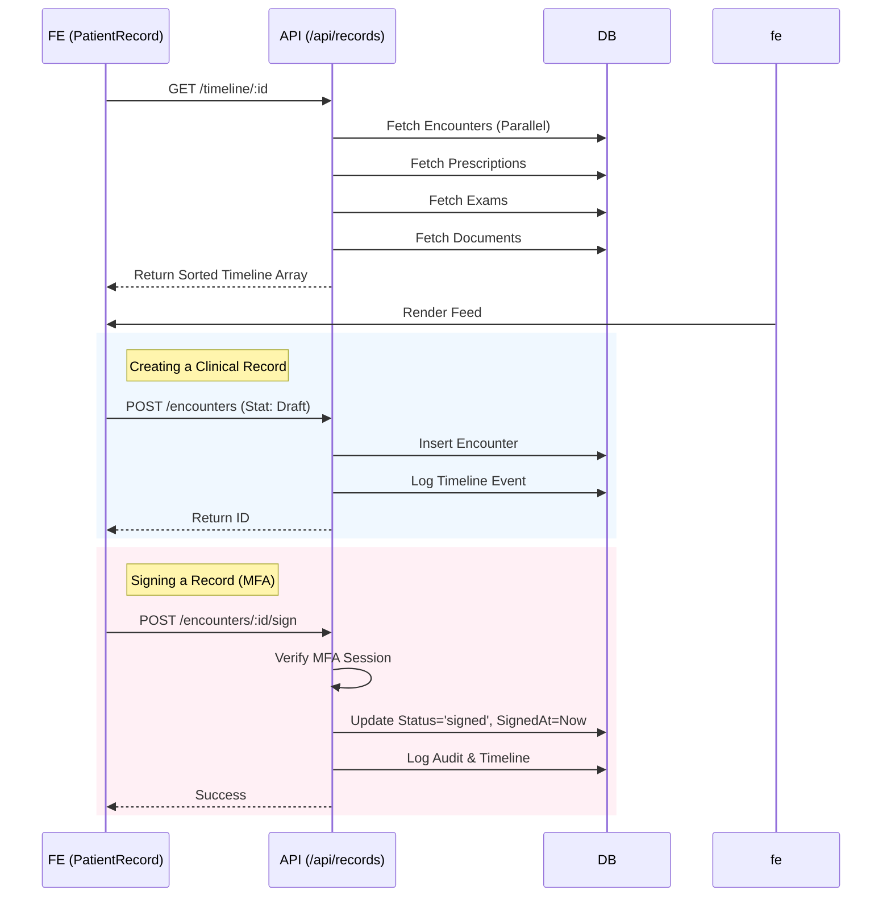

# Module: Patients & Records

**ViewTypes**: `PATIENTS`, `PATIENT_RECORD`, `CLINICAL_EXECUTION`, `DOCUMENTS`, `ANAMNESIS`, `TREATMENT_JOURNEY`
**API Routes**: `/api/patients`, `/api/records`, `/api/treatment`, `/api/anamnesis`

## 1. User Journey (Flowchart)

```mermaid
graph TD
    Dashboard -->|Click Patients| PatientList[Patient List]
    PatientList -->|Add Patient| CreatePatientModal
    PatientList -->|Select Patient| PatientRecord[Patient Record View]
    
    subgraph "Patient Record Tabs"
        PatientRecord --> TabTimeline[Timeline (Feed)]
        PatientRecord --> TabClinical[Clinical (SOAP/Encounters)]
        PatientRecord --> TabOdonto[Odontogram]
        PatientRecord --> TabDocs[Documents & Files]
        PatientRecord --> TabAnamnesis[Anamnesis]
        PatientRecord --> TabPlans[Treatment Plans]
    end
    
    TabClinical -->|New Encounter| EncounterForm[SOAP Form]
    EncounterForm -->|Save Draft| DraftState
    EncounterForm -->|Sign| SignedState[Signed (Locked)]
    
    TabOdonto -->|Select Tooth| ToothModal
    ToothModal -->|Set Condition| UpdateOdontogram
    
    TabDocs -->|Upload| S3Upload
    TabDocs -->|Generate| PrescriptionGen[Prescription Generator]
```

## 2. Technical Flow (Sequence Diagram)



## 3. State Machine (Encounter)

```mermaid
stateDiagram-v2
    [*] --> Draft
    
    state Draft {
        [*] --> Editable
        Editable --> Saving: Auto-save
        Saving --> Editable
    }
    
    Draft --> Signing: User clicks "Finalize"
    
    state Signing {
        [*] --> RequestMFA
        RequestMFA --> Verifying
        Verifying --> Signed: Valid Code
        Verifying --> RequestMFA: Invalid
    }
    
    Signed --> [*]
    note right of Signed
        Record is Locked (Read-Only)
        Modifications require
        Addendum/Rectification
    end_note
```

## Data Models

*   **Patients**: Core identity. `organizationId` isolated.
*   **Encounters**: SOAP notes. Linked to `appointments` (optional).
*   **Odontogram**: Tooth-level status (`current` vs `history`).
*   **TreatmentPlans**: Group of procedures + cost.

## Gaps & Risks

*   **Delete Policy**: Hard delete is restricted (`patients.ts`), but "Archive" logic needs to be robustly handled in all UI lists (currently filter might be missing in some selects).
*   **Odontogram History**: Current implementation inserts new rows for updates. Need to refine how "current" status is maintained versus historical data to avoid cluttering queries.
*   **Concurrency**: No optimistic locking on Encounters. Two users editing same draft might overwrite.
